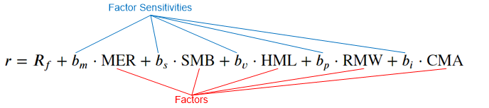
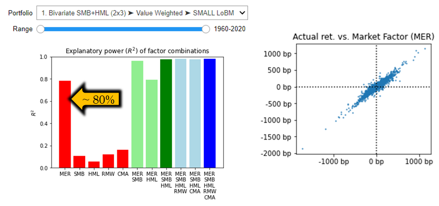
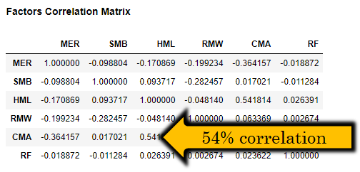
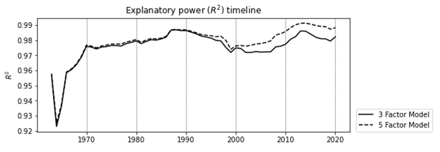
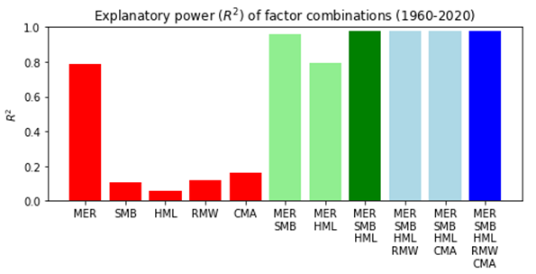

# Implementation of 5-factor Fama French Model
This project contains implementation of five factor Fama French model + jupyter notebook for exploratory analysis.

### Risk Factor
Certain characteristic of economy (Inflation/GDP) or stock market itself (S&P 500)

### Factor Model
Factor model uses movements in risk factors to explains portfolio returns

### Questions which factor investing answers
* Why different asset have systematically lower or higher average returns?
* How to manage the asset portfolio with the underlying risks in mind?
* How to benefit of our ability to bear specific types of risks to generate returns?

### Fama-French Model
Assumes linear relationship between empirical factors and stock returns:

* Market Factor (MER)
* Size Factor (SMB)
* Value Factor (HML)
* Profitability Factor (RMW)
* Investment Factor (CMA)

**Factors** are constructed daily from definitions, as illustrated previously

* They are global for the entire stock market

**Factor sensitivities** are calibrated using regression

* They represent “reward for taking a specific risk”, which is different for every stock
* Risk/Reward relationship is expected to hold over time
* Objective: maximize the model’s predictive power R2

### Market Excess Return (MER)
* Market excess return (over RF rate) alone explains around 80% of asset movements
* Daily returns are ~normally distributed
* Relationship between returns of the overall market and returns of selected portfolio

### Size (SMB) factor
* Small-cap companies typically bear additional risk premium - was it always the case?
* Python can help you to see that this factor has a different prevalence in different economic regimes

### Value (HML) factor
* Value companies trade at higher yields to compensate for lack of growth potential
* Python can help you to see that this factor has different explanatory power in different market situations and on different portfolios (very interesting)

### Profitability and investment factors
* <u>Profitability factor></u> (RMW) to attribute superior returns of companies with robust operating profit margins and strong competitive position among peers
* <u>Investment factor</u> (CMA) to segment companies based on their capital expenditures
* **Analysts opinion**: High capex structurally associated with growth companies, which puts usefulness of this factor in question

### Evaluating 5-factor model
* Analyst opinion: High correlations between risk factors puts usefulness of 5-factor model into question.
* R2 10-20% for RMW, CMA
* 5 factor improvement only by 0.2%

### More features and information
* Interactive return attribution
* Time-series analysis
* Portfolio returns and factors loaded from Fama-French data library (https://mba.tuck.dartmouth.edu/pages/faculty/ken.french/data_library.html)
* Please refer to the blog post http://www.quantandfinancial.com/2020/06/famafrench.html for more details
