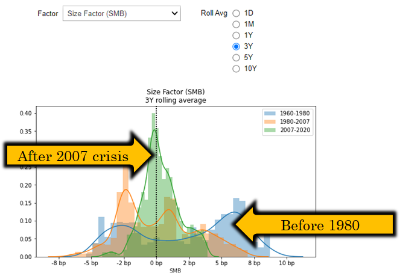
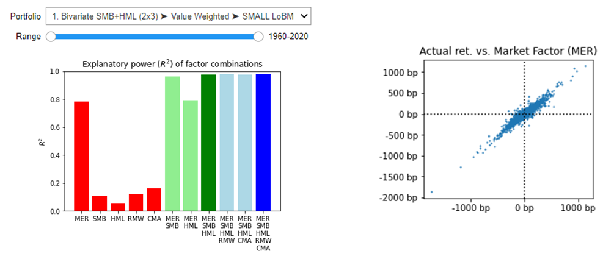
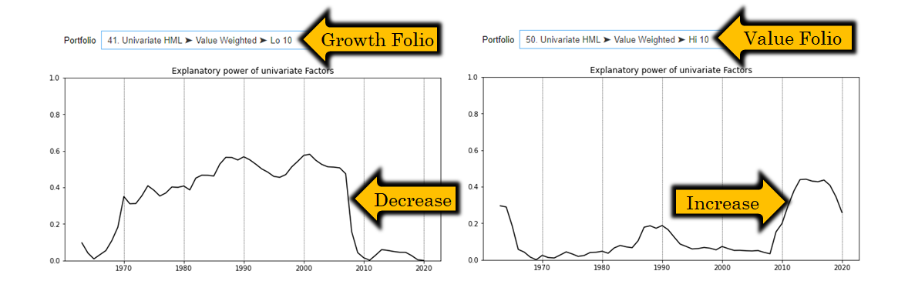
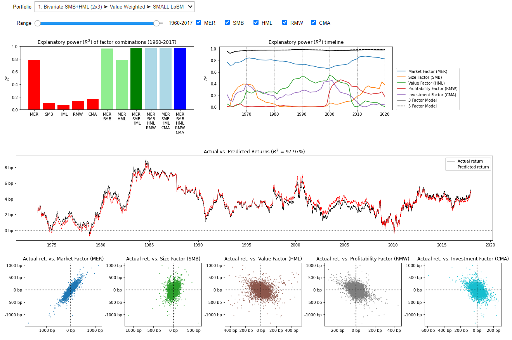

# Implementation of 5-factor Fama French Model

This project contains implementation of five factor Fama French model + jupyter notebook for exploratory analysis.

Please refer to the blog post http://www.quantandfinancial.com/2020/06/famafrench.html for more details

Features:
* Portfolio returns and factors loaded from Fama-French data library (https://mba.tuck.dartmouth.edu/pages/faculty/ken.french/data_library.html)
* Interactive return attribution
* Explanatory analysis of return factors
	* Market factor (MER)
	* Size factor (SMB)
	* Value factor (HML)
	* Profitability factor (RMW)
	* Investment factor (CMA)
* Time-series analysis

Few screenshots from the jupyter notebook:

## Statistical analysis of individual factors in different economic regimes

## Analysis of explanatory power of individual factors

## Time-series analysis of a factor on different portfolios

## Full intractive UI

